Background
====================

Connected vehicle technology uses in-vehicle wireless transceivers to
broadcast and receive basic safety messages (BSMs) that include accurate
spatiotemporal information to enhance transportation safety. These
devices rely on integrated Global Positioning System (GPS) measurements
to improve driving safety. Databases, some publicly available, of BSM
sequences, called trajectories, are being used to develop safety and
traffic management applications. BSMs do not contain explicit
identifiers that link trajectories to individuals; however, the
locations they expose may be sensitive and associated with a very small
subset of the population; protecting these locations from unwanted
disclosure is important. Public sector policies require research data
that is made publicly available should be recorded in such a manner
that subjects cannot be identified, directly or through identifiers
linked to the subjects. A procedure that minimizes the risk of
associating trajectories with individuals, or deidentification, is
necessary to meet open data requirements.


Index
====================
- [Deidentification Purpose and Objective](#deidentification-purpose-and-objective)
- [Data Deidentification and Data Utility](#data-deidentification-and-data-utility)
- [Deidentification Algorithm Concepts](#deidentification-algorithm-concepts)
- [Deidentification Nomenclature](#deidentification-nomenclature)
- [Map Preprocessing](#map-preprocessing)
- [Map Matching for Deidentification](#map-matching-for-deidentification)
- [Basic Deidentification Algorithm](#basic-deidentification-algorithm)
- [Critical Interval Metrics](#critical-interval-metrics)
- [Privacy Interval Metrics](#privacy-interval-metrics)
- [Data Limitations and Data Error Handling](#data-limitations-and-data-error-handling)
- [Route Sanitizer User Interface](#route-sanitizer-user-interface)
- [General Layout of User Interface](#general-layout-of-user-interface)
- [User Interface Elements](#user-interface-elements)
- [Workflow Outline](#workflow-outline)
- [Use of Open Street Maps](#use-of-open-street-maps)
- [Input Files](#input-files)
- [Configuration](#configuration)
- [Advanced Configuration](#advanced-configuration)
- [Map](#map)
- [Verifying Sanitized Trip Files](#verifying-sanitized-trip-files)
- [Logging](#logging)
- [Multi-threading](#multithreading)
- [Example OSM File Format](#example-osm-file-format)
- [Example Quad File Format](#example-quad-file-format)
- [Example Input File Format](#example-input-file-format)
- [Output Directory and File Name Structure](#output-directory-and-file-name-structure)

Deidentification Purpose and Objective
---------------------------------------

We consider Personally Identifiable Information (PII) as information that
identifies an individual or their characteristics *directly*. Other types of
data are more appropriately classified as *personal information* since it
pertains to an individual, but it does not directly identify an individual
[NIST SP 800-188](https://csrc.nist.gov/CSRC/media/Publications/sp/800-188/draft/documents/sp800_188_draft2.pdf).
For a connected

vehicle, a sequence of BSMs also describes the spatiotemporal trajectory
of its human operator.

Operator privacy is a principle concern as applications are being
developed using trajectory databases. Removing direct identifiers and
any static fields that reduce identifiable subpopulations is only the
first step. Frequently-visited locations, travel patterns, religious and
sexual preferences, social customs, and driving characteristics are
examples of information that can be inferred from vehicle trajectories.

*Deidentification* (a.k.a. *sanitization*) is a process that seeks to
minimize the possibility of associating personal information, to include
identifying information, with a data subject [NIST SP 800-188](https://csrc.nist.gov/CSRC/media/Publications/sp/800-188/draft/documents/sp800_188_draft2.pdf).
Successful identification of an individual whose identity has been
ostensibly obfuscated by deidentification is *re-identification*. We
differentiate deidentification and *anonymization*; the latter implies
re-identification is rendered impossible [NIST SP 800-188](https://csrc.nist.gov/CSRC/media/Publications/sp/800-188/draft/documents/sp800_188_draft2.pdf). Perfect
deidentification is difficult, if not impossible. However, effective
deidentification techniques reduce the chance for inadvertent exposure
of a person’s private trip data to adversaries.

Re-identification is becoming more and more of a concern in the age of
big data.  While a single piece of information may be innocuous on its
own, it could be linked to other, often public, data sources to begin to
build a dossier about a person that could be used in unwanted ways. For
trip data, this can be as easy as using the termination point of the
trip to lookup a street address (known as reverse geocoding) and then
use the street address to lookup the resident’s names (using a variety
of on-line tools). Usually, the details we can learn from a single trip
do not pose that much of a privacy risk; but, when many trips are
associated with a particular individual, the risk to individual privacy
grows.

Initially, the deidentification task seems straightforward: remove the
endpoints or create safe zones (geofences) where privacy is not needed.
This has been shown to be insufficient, so we need a better way of
approaching the deidentification task. Another reason the
straightforward approach is insufficient is each person defines privacy
differently; some location in the middle of a trip may be more sensitive
than a trip’s termination points. How do we generalize determining which
locations should remain private and which are acceptable to release?
Furthermore, how do we “protect” those locations from individuals having
access to different types and amounts of auxiliary information that
might aid the re-identification task using different amounts of skill.
How do we account for different types of road layouts? A standard method
for de-identifying spatiotemporal trajectories has yet to be
established; however, this algorithm makes deidentification adaptable
by providing the data steward parameters to balance privacy protection
and data utility.

Data Deidentification and Data Utility
---------------------------------------

Privacy-preserving data is published for analysis to improve technology
and enhance situational awareness.  The types of research that can be
conducted and its accuracy depend significantly on how the data has been
modified. Our deidentification procedure was not developed for a
particular use case. As connected vehicle applications are still under
investigation, to utility of de-identified data in specific scenarios
continues to be evaluated with specific attention being given to traffic
management and analysis applications.

Data utility describes how useful a form of data is in accomplishing a
particular objective. Some de-identified data may facilitate
accomplishing the objectives of a particular data application while the
same data may be useless for another task. Data utility depends on the
data application’s objective. Balancing data deidentification and data
utility is a dilemma: researchers and technology developers may make
huge breakthroughs without a care in the world about individual
identities when given original data, but malicious parties will use the
same data for personal gain or to the detriment of another party by
purposely associating the information with an individual. Our goal as
data stewards is to provide data that can still be useful to researchers
and technology developers, but makes the re-identifier’s job extremely
difficult.

Open data research will improve connected vehicle technology and lead to
new uses for this valuable resource. Furthermore, open data research
increases the transparency of the connected vehicle program, and it may
ease individual concerns about privacy by showing that such data can be
released in de-identified form with minimal risk to individual privacy.

Deidentification Algorithm Concepts
============================================

This section of the manual describes the deidentification algorithm
used in Route Sanitizer in enough detail to understand how the
user-modifiable parameters on the Configuration and Adv. Configuration
tabs affect the algorithm.

The deidentification process is separated logically into 5
subprocesses. Each subprocess is controlled by a set of parameters that
can be used to tune deidentification depending on the acceptable risk.
The deidentification subprocesses, and the tab in the Route Sanitizer
user interface where the parameters can be modified, are:

1. Map preprocessing (OSM tab)
2. Fitting trajectories to maps (Adv. Configuration tab)
3. Detection of critical intervals (Adv. Configuration tab)
4. Generation of privacy intervals (Configuration and Adv. Configuration tabs)
5. Final point suppression

Users who want to change any of the parameters on the Configuration and
Adv. Configuration tabs should have a good understanding of the
algorithm basics and how various parameters affect the algorithm before
making changes to the default values.

Each of the deidentification subprocesses is described in the following
sections, preceded by a section defining the deidentification
nomenclature used in the descriptions. Each subprocess section describes
the basic algorithm theory and how the user modifiable parameters affect
the algorithm.

Deidentification Nomenclature
------------------------------

A **trip**, or **trajectory**, is a time-ordered, sequence of
records (tuples) that are generated using BSM information. Each record
includes, at a minimum, the time, a **geopoint** (latitude,
longitude), a heading, and speed.  In the figure below, the gray dashed line
represents an original trip; the individual dashes represent the records
that make up a trip. A **trip (trajectory) subsequence** is a subset
of records with the same order relation; records in a trip subsequence
do not have to be adjacent with respect to the original trip sequence –
a single subsequence may have gaps where records have been removed. On
the other hand, a **subtrip** is a trip subsequence with no record
gaps between the subtrip’s first and last record with respect to the
original trip (blue dashed line in figure below). A **prefix subtrip** is a
subtrip that includes the first record in the trip; a **suffix
subtrip** is a subtrip that includes the last record in the trip.

The term **feature** is used to describe a subtrip that represents
some unique and distinguishing characteristic of the trip; it may be
based on vehicle behavior, geographic position, or position within the
original trip.

The term **uncertainty** is used periodically throughout this
document. For our purposes, uncertainty is characterized from the
perspective of the re-identifier: when we introduce uncertainty the
re-identifier’s job becomes more difficult – this is one objective of
deidentification.

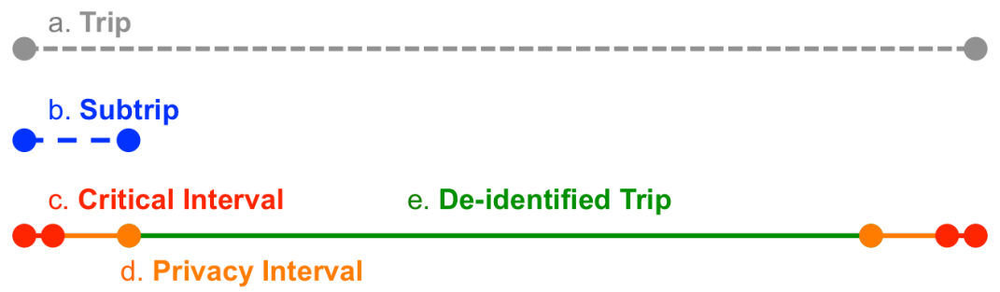

A **critical geopoint** is a geopoint that may contribute to
re-identification. Critical geopoints are candidate locations that
require additional analysis to determine whether or not they pose a risk
to individual privacy. For example, a geopoint that places a vehicle in
a driveway is a critical geopoint independent of whether that driveway
is connected to the driver’s home or not. In some cases, criticality is
based on behavior rather than geography. To address both location and
behavior, we define a **critical interval** as a subtrip that
includes only critical geopoints; a critical interval can occur anywhere
in a trip. The red subtrips in above figure represent critical intervals.

Critical intervals are removed during deidentification along with
intervals that extend from either side of a critical interval to
introduce additional uncertainty; these additional intervals are called
**privacy intervals**. The two orange segments in above figure represent
different privacy intervals. Together, these privacy intervals form a
trip subsequence. Similarly, the critical interval and privacy interval
at the beginning of the trip (marked c. and d.) together make up a
subtrip – there are no geopoints between these two intervals. The
subtrip they form is also a prefix subtrip. A critical interval at the
beginning or end of a trip can only be extended in one direction.

Due to the way in which distance and GPS jitter can affect the
deidentification process, we need to distinguish between critical and
privacy intervals. For example, a driver that sits in his or her
driveway for 20 minutes has covered no real distance; however, the GPS
jitter may have induced an artificial distance (the length computed will
depend on the loiter time). This small artificially induced distance is
included in the critical interval, so it will not unnecessarily
influence how the privacy interval is created. If it were included in
the privacy interval, then it could skew deidentification in the
re-identifier’s favor by not introducing enough uncertainty.

Map Preprocessing
-----------------

The robustness of the deidentification process can be improved by
integrating map data from Open Street Map (OSM) files. The OSM
information used includes:

- A geographically anchored graph (i.e., labeled edges and
vertices) is constructed from OSM nodes and ways (a sequence of
segments). To accommodate curvature, OSM may use hundreds of segments
(edges) to define a single way (i.e., road); each segment is a straight
line between two distinct nodes (i.e., geopoints, vertices).

- The number of segments (edges) that come together at an
intersection. This is called the degree of a vertex; it corresponds to
the choices a driver, or re-identifier, has when encountering the
intersection.

- OSM highway type.

Since the OSM files contain more information than the deidentification
algorithm requires, Route Sanitizer provides a tool on the OSM tab to
reduce and format the OSM information into a form that the sanitization
algorithm can use more efficiently. An option to limit the map data to
within a specified geographical area is included. The reduced map
information is output to a “quad” file. Currently, Route Sanitizer can
only use quad files containing reduced OSM data for the map-fitting
process.

Map Matching for Deidentification
--------------------------------

BSM input files contain data which defines trips as a sequence of line
segments. OSM map files contain data which defines roads on a map as a
sequence of line segments. The basic idea in map-fitting is to find the
road line segments in the OSM file which most closely match the trip
line segments in the BSM input file. If road network specifications in
OSM files were always reliable and GPS measurements always accurate,
then this matching of line segments would be easy. In practice, quality
issues exist with both and an efficient approach to map-fitting is
needed.

The Route Sanitizer algorithm uses two constructs in the map-fitting
process and the number of user modifiable parameters associated with
each:

1. Explicit Box (3 parameters)

1. Implicit Box (2 parameters)

An explicit box (purple boxes in the above figure) is used for matching BSM trip
segments (thin line inside boxes in the above figure) to OSM road segments (e.g.
white highway lines in the above figure). If a match cannot be found, the
algorithm then constructs an implicit box (red boxes in the above figure) for
the trip segment. Several user changeable parameters on the Route Sanitizer Adv.
Configuration tab are used to control the explicit and implicit box map-fitting.
The default configuration settings work well in most cases, and we recommend
leaving them alone unless new settings have been verified through
experimentation and KML inspection.

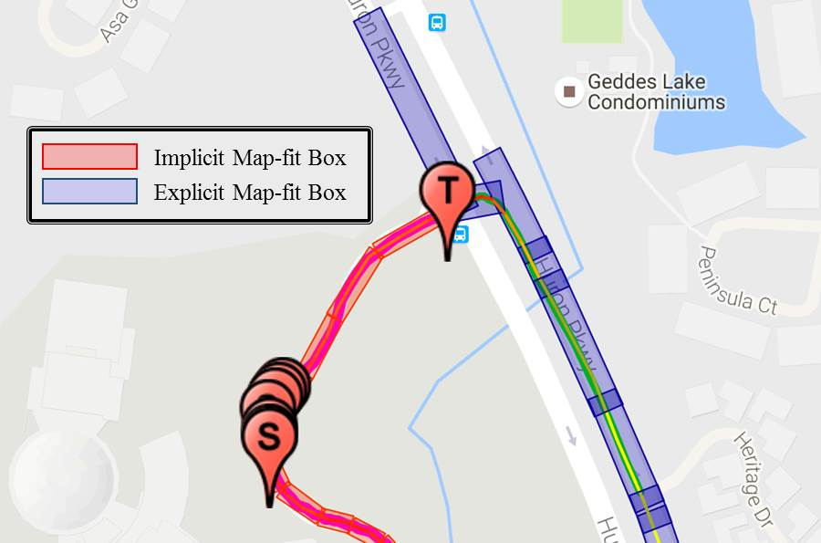

### Explicit Box

The sanitization algorithm attempts to identify the OSM road segment
associated with the physical road that the driver was originally on when
their on-board equipment (OBE) or vehicle-aware device (VAD) generated
the BSM record captured in the trajectory file. This map fitting process
is made easier by encapsulating each OSM road segment in an “explicit
box.”

The above figure illustrates the geometry of an explicit box that encapsulates
an OSM road segment (red line segment in gray box).  The dimensions of each box
are determined by the length of the OSM segment and several user input
parameters. In the above figure, the outer box represents the default box and
the darker shaded inner box is a scaled boxed determined by input parameters and
used in the deidentification process. The map-fit extension length and width
scaling factor parameters used in determining the scaled box are discussed in
more detail below.


#### Map-fit extension length

Each box can be extended beyond the endpoints of the encapsulated OSM
road segment. The amount the box is extended on each end is specified by
the extension length. Each box has two edges that run perpendicular to
the road segment (the left and right ends of the boxes in the previous figure). If
you specify a zero extension length, these edges are constrained to
intersect the road segment at each end in the map fitting process.
Because the OSM map may not accurately represent the road location,
setting this parameter to zero may make the map-fitting process more
difficult and less accurate overall. When non-zero, the box edges are no
longer forced to intersect the OSM segment it contains; there is an
“error” factor introduced that may help the accuracy of map fitting in
certain intersection configurations.

#### Map-fit width scaling

The highway types for segments specified in OSM are used to infer the
width of the road a vehicle travels on (e.g., highways have multiple
lanes and are wider than single lane residential roads), and accordingly
the width of the box used in map fitting. The width dimension used for
each highway type is fixed in the sanitization algorithm, but can be
adjusted using a scaling factor to obtained a box that is wider or
narrower than the fixed settings (e.g., actual width = scale factor x
OSM road width). A scaling factor of 1.0 leaves the values unchanged; a
scaling factor of 0.5 makes the boxes half as wide as the pre-specified
road width; a scaling factor of 2.0 makes the boxes twice as wide. The
same scale factor is applied to all roads regardless of the OSM highway
type. An on/off user input parameter controls whether or not the scale
factor is “enabled”, i.e., applied, during the deidentification
process.

The sanitization algorithm is more efficient when trajectory points are
contained within a “fit” box. When GPS measurements drift, the
measurements may necessitate initiating a new search for the OSM segment
that corresponds with the drifting trajectory point.  Width scaling is
used to accommodate some drift without a significant drop in
sanitization performance.

### Implicit Box

In some cases, an OSM road segment may not exist for a road being
traveled by a connected vehicle. In these cases, the sanitization
algorithm generates “implicit” boxes that it uses to detect certain
types of behavior that might be associated with private locations. How
these implicit boxes are constructed is determined in part by the two
user input modifiable configuration parameters.

#### Implicit Heading Groups

A vehicle does not change its heading significantly when it travels on a
straight road segment. In order to capture this type of behavior, the
face of a compass (e.g., 0 to 360 degrees), a.k.a. “compass rose”, is
divided into quadrants. While a vehicle’s heading remains within a
particular quadrant, we assume the vehicle remains on an “implicit” road
segment, an unknown or unspecified OSM road segment. The Implicit
Heading Groups configuration parameter determines the size of each
quadrant indirectly by specifying the number of equally sized quadrants
to divide the compass rose into. For example, but default the compass
rose is divided into 36 quadrants; each quadrant is 10 degrees.

#### Minimum Implicit Edge Trippoints

Sometimes GPS measurement errors manifest as rapid heading changes. The
Minimum Implicit Edge Trippoints configuration parameter specifies the
minimum number of trajectory points that must be contained in an
implicit box before a new one is created.

The above configuration parameters work together to “infer” unspecified
OSM road segments; the segment bisects the “implicit” box.  These are
usually associated with parking lots, drive ways, or access roads.  An
implicit road segment will never contain fewer than “minimum implicit
edge trippoints” even when the vehicle’s heading has deviated outside of
a given quadrant.

Basic Deidentification Algorithm
---------------------------------

The figure below depicts a trip to which the Route Sanitizer deidentification
procedure has been applied. The deidentification algorithm processes
each trip subsequence to 1) identify critical intervals and 2) remove
critical intervals and privacy intervals. The algorithm deploys
“detectors”, i.e., code algorithms that detect where or when something
happens, to locate the critical intervals. During deidentification,
each privacy interval is constructed by examining the records that occur
immediately prior to the first record in the critical interval and
immediately after the last record in the critical interval. Various
metrics and parameters are used to tweak the deidentification process
to ensure that adequate uncertainty has been introduced to the trip for
privacy.


During the deidentification process, the algorithm applies the
following assumptions and rules to determining the critical and privacy
intervals:

1. A **critical interval** must be non-empty. Accordingly, each
**critical interval** can be characterized by a set of features that
characterize our general idea of personal privacy.

1. For each **critical interval**, there exists a set of parameters
that determine the sensitivity of the detectors that find locations
having characteristics that make them private.

1. A **privacy interval** can be empty. In this case, elimination of
the **critical interval** provides sufficient uncertainty to protect the
individual’s privacy. This rule allows us to generalize how **privacy
intervals** are connected to **critical intervals**.

1. For each **privacy interval**, there exists a set of parameters
that characterize how much uncertainty is introduced by eliminating that
interval.

1. Two **privacy intervals** are associated with each **critical
interval.** One **privacy interval** regresses toward the beginning of
the trip; this is called the **backward privacy interval**. The second
**privacy interval** moves forward in the trip; it is called the
**forward privacy interval**. Together the forward and backward privacy
intervals are called the **privacy region**; each **critical interval**
is associated with a **privacy region**. The prefix critical interval
has an empty backward privacy interval; the suffix critical interval has
an empty forward privacy interval. Certain internal privacy intervals
have empty privacy intervals.

1. The intersection of each **critical interval**, **privacy
region** pair is empty and their union is a subtrip.

1. The intersection of all **privacy intervals** in a trip is empty,
i.e., **privacy intervals** do not overlap.

Critical Interval Metrics
-------------------------

As discussed previously, critical intervals characterize locations that
should remain private. Since we do not have any additional information
about the driver, the sanitization algorithm finds critical intervals by
analyzing the characteristics of trajectories. Route Sanitizer uses
“detectors”, i.e., coded software algorithms whose function is to detect
something, to locate critical intervals. The 3 defined detectors used by
Route Sanitizer, and the number of user modifiable parameters associated
with each detector, are:

1. Trip beginning and endpoint detector (0 parameters),
1. Vehicle turnaround detector (4 parameters),
1. Vehicle stop detector (3 parameters).

Trajectory points associated with certain types of GPS errors are
automatically removed independent of the above critical interval
detectors. GPS units can “park” themselves at the poles or equator prior
to acquiring enough satellites to determine their position accurately.
These points can cause the deidentification algorithm to incorrectly
determine what needs to be removed; in some cases, it can lead to
private locations remaining in the final trajectory file. Accordingly,
these points are removed prior to any determination of what should be
removed.

### Trip beginning and endpoint detector

Beginning and endpoint detection is always active and has no associated
parameters. After GPS error points have been removed, this detector
marks the beginning and endpoints of each trajectory as critical. Based
on numerous studies, beginning-end point pairs are highly
distinguishing.

### Vehicle turnaround detector

Turnarounds are only detected when the speed of the vehicle is below a
user modifiable maximum speed parameter. Two different strategies are
used for detecting turnarounds:

1. One strategy retains a queue of consecutive implicit boxes (the
trajectory is not on an OSM segment). User modifiable parameters include
the maximum queue size, i.e., the maximum number of implicit boxes that
can be maintained on the queue, and the width of the generated implicit
boxes. When the queue list reaches its maximum size, the oldest box in
the list is removed prior to adding the new box. If a vehicle re-enters
an implicit box in this list, a turnaround critical interval is
generated. Wider boxes increase the likelihood of detecting a
turnaround, but could also lead to detecting behavior that should not be
considered a turnaround (i.e., a false positive). This strategy operates
based on the idea that turnarounds on well-defined roads will not be
considered private (there are other ways to detect behavior on
well-defined roads that may be considered private).

1. Another strategy retains the heading of the vehicle when it
leaves an explicit box (e.g., a box that encapsulates an OSM road
segment) and compares that heading to the heading of the vehicle when it
re-enters an explicit box. If the heading delta (i.e. difference)
exceeds the threshold defined by a user modifiable parameter, a
turnaround critical interval is generated. Again, we are attempting to
identify portions of trajectories that are not on well-defined roads.
When no map information is available the first strategy continues to
work well; however, the second strategy will not work since it relies on
explicit boxes.

### Vehicle stop detector

Stops are detected in two phases based on several conditions. First,
travel on certain road types and at speeds exceeding a threshold are not
analyzed for stop-like behavior. When a vehicle’s speed drops below the
speed threshold, and it is *not* on one of the designated road types,
stop-like behavior is defined based on total distance traveled over a
predefined time-period. The speed, minimum distance, and maximum time
thresholds are all user modifiable parameters.

For example, assume traveling less than 15 meters in 2 minutes is
stop-like behavior (this equates to an average velocity of 0.28 mph).
Since GPS error may affect speed measurements, a vehicle whose velocity
becomes 0 may never record a 0 speed. Likewise, a vehicle caught in a
traffic jam should not be flagged as a stop even though their velocity
could be 0 for a while. Our definition of a stop does not use velocity
directly.

Privacy Interval Metrics
------------------------

As discussed previously, privacy intervals “protect” critical intervals
by determining how much of the trajectory surrounding the critical
interval should be removed. The amount removed depends on a criterion
that is defined using the following 3 metrics:

1. Direct Distance
1. Manhattan Distance
1. Intersection Out-Degree Count

Each of these 3 metrics includes a minimum and maximum parameter value
as well as a randomness parameter value for a total of 9 parameters used
to control privacy intervals.

### Direct Distance

Direct distance is the distance between the start of the privacy
interval and the trip point currently being evaluated during
deidentification (i.e., the point-to-point distance). This metric
provides a radius of protection around each critical interval.

### Manhattan Distance

Manhattan distance is the actual distance traveled over the road
network; this is computed using the explicit and implicit boxes
generated during map fitting. By using the OSM or implicit edges the
metric is made more accurate as it removes some of the GPS error
introduced by the sensor. If the road network is complex with many
angles, particularly acute angles, this value could be much larger than
direct distance. In most cases, Manhattan distance is a better measure
to introduce uncertainty than direct distance.

### Intersection Out-Degree Count

Out-degree is the number of possible directions a driver could choose at
a particular intersection. Assume a driver is approaching the green dot
in the center of the figure below along the path indicated by the red arrow. The
out-degree of this intersection is three, since there are three possible
choices they “could” take. As a trajectory is being de-identified, the
intersection out-degree is accumulated from the start of a privacy
interval to the endpoint of a segment that defines an explicit box.
Intersection out-degree count has the most direct correlation to
uncertainty.


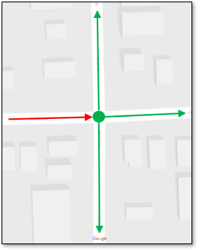

### Which criterion to use

The diversity of living situations across the United States presents an
interesting deidentification challenge. A driver may live at the end of
a very long road with no other houses on that road. In this case,
distance is a poor metric to use by itself to determine when a privacy
interval should be terminated. Some neighborhoods are developed around a
complex network of roads that intersect with one another but have only
one or two main exit points. In this case, intersection count may be the
least effective measure to terminate a privacy interval, but direct
distance would provide a radius of protection that could be highly
effective. Also in this case, Manhattan distance may even be ineffective
if the driver took a convoluted route through the neighborhood to return
to his or her residence. To accommodate introducing a more general level
of uncertainty, all of these measures are included in the criterion used
to terminate a particular privacy interval.

### Minimum and maximum values

Each privacy interval measure condition is specified using a minimum and
a maximum value. If any measure up to the current trip point exceeds the
maximum threshold value, the privacy interval is terminated and
deidentification stops for that “forward” or “backward” process
independent of the other two measures. If a maximum condition is not
met, each measure is checked against the minimum threshold values. If
all of the minimum threshold values are exceeded, the privacy interval
is terminated and deidentification stops for that process. If a maximum
condition or all minimum conditions are not met (along with the
aforementioned general criteria), the current privacy interval continues
to be extended. Maximum threshold values are “safety valves” that avoid
too much data loss during trip truncation; they preserve data utility.
“Safety valve” values are not intended to terminate trip truncation
often; they are intended to handle exceptional cases. On the other hand,
the minimum threshold values (considered together) are intended as the
normal means to determine when trip truncation stops. The minimum
parameters ensure a certain level of uncertainty is always introduced.

### Randomness values

To provide an additional level of protection against unanticipated
special cases, privacy intervals can be extended by some random
distance.

The previous section describes several measures and conditions for
halting trajectory truncation during deidentification. Based on the
operational intent of these parameters, randomness is applied to the
minimum threshold values only, since they are the “normal” means of trip
truncation.

Each setting is a real-valued proportion greater than or equal to 0 and
less than or equal to 1.0, e.g., 0.25 or 0.87. These values can be
thought of as a percentage, e.g., 1.0 = 100%. In order to compute the
random minimum for a particular condition used to determine the length
of the privacy interval, the proportion value is multiplied by the
difference between the minimum and maximum threshold parameters (i.e.,
maximum threshold value - minimum threshold value) to obtain a threshold
factor (i.e., the portion of the difference to randomize). The threshold
factor remains constant throughout the deidentification process. The
random minimum threshold is determined uniquely for each privacy
interval by multiplying the threshold factor by a real-valued random
number between 0 and 1 inclusive and adding that value to use-specified
minimum threshold. *If a proportion value is 0.0, no randomness will be
applied.* A value of 0.0 should be used when the results of successive
runs with identical parameter settings are expected to be identical
(i.e., deterministic deidentification is desired for testing). On the
other hand, a value of 1.0 will introduce the greatest degree of
randomness to the deidentification process. Any value greater that 1.0
will be ignored since the maximum threshold value will “kick in” and
halt truncation.

Data Limitations and Data Error Handling
----------------------------------------

The deidentification algorithm handles some, but not all, data errors.
The errors that are handled have been found to negatively impact the
privacy protection provided by the algorithm, so their removal prior to
or during deidentification is important. The deidentification
algorithm is not meant to be a data validation tool, but it must perform
some of these functions. The list that follows describes these errors
and how they are handled:

- GPS Parking: Some GPS units “park” at one of the poles or the
equator when they are initially turned on. As more satellites are
acquired, a more precise object position is determined. When the initial
positions in a trajectory are “parked,” large distances can be
accumulated between the parked position and the first real measured
position in the trajectory. These distances will trigger termination of
privacy intervals prematurely leaving the sensitive locations
insufficiently protected against geoposition inference attacks.
Accordingly, **GPS parking positions are removed from the dataset prior
to beginning the deidentification process.** If only intersection out
degree is used to determine when privacy interval termination should
occur, this problem is mitigated to a large degree.

- GPS Errors: Occasionally, a GPS unit will measure an inaccurate
position. Similar to GPS Parking, these positions can affect the
distance measurements used to create privacy intervals. The algorithm
attempts to detect these position errors and remove them, so they do not
affect generation of privacy intervals. Since these positions are not
fixed (similar to GPS parking positions), some error may remain in the
dataset and could cause deidentification errors. **GPS error points are
detected and removed from the beginning and ends of trajectories.** If
only intersection out degree is used to determine when privacy interval
termination should occur, this problem is mitigated to a large degree.

- Data Parsing Errors: If a BSM record contains an entry in one of
the key fields that is outside of the range of acceptable values and
would affect the algorithm’s function, that record is eliminated. For
example, if vehicle heading was less than 0 or greater than 360 degrees.
**We have also found non-ASCII characters in the dataset will affect the
algorithm. These should be removed prior to running the algorithm, since
they cannot be parsed.**

GPS errors are particularly problematic when they are not due to parking
and when they occur within a trajectory (i.e., not the first or last
record). The problem is knowing which records are accurate and which
records are inaccurate without having GPS precision information provided
by the measurement device. In some cases, we have found trajectories
where all positions are errors, but few were due to parking. Such
trajectories present less risk to individual privacy because none of the
positions accurately reflect the travel of the driver.\

Route Sanitizer User Interface
======================================

Introduction
------------

The deidentification tool Route Sanitizer provides a graphical user
interface to the connected vehicle deidentification algorithm.  It uses
the Google Chrome platform so it will run on different computing
platforms. The basic deidentification strategy used is trip redaction:
portions of a vehicle trajectory are removed. It does not alter the
individual Basic Safety Message (BSM) records it retains. The algorithm
integrates external map information to better protect against “inference
attacks” by intelligently obfuscating locations, or introducing
uncertainty. It also uses some novel mechanisms to detect locations that
individuals may consider private. To tool aims to err on the side of
privacy, but provides numerous parameters that allow the practitioner to
adjust the sensitivity of the private location detectors as well as
parameters to adjust how much of the data is removed around those
locations thereby making the re-identifiers job more and more uncertain.

General Layout of User Interface
--------------------------------

The application consists of six components arranged as shown below:

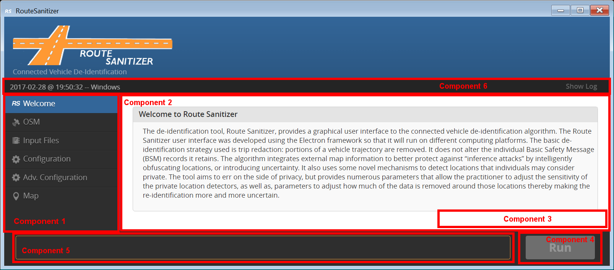

- Component 1 is the main menu consisting of several “Tabs”
arrange vertically. The tabs are arranged in workflow order.

    - **Welcome Tab**: General information and links to documentation.

    - **OSM Tab:** Generation of Route Sanitizer map data from OSM files.Configuration Tab: Settings that control how deidentification is performed.

    - **Input Files Tab**: Specify the file(s) that should be de-identified.

    - **Configuration Tab:** The option and parameter settings that
determine how deidentification will be performed, where the map data
will be obtained, and where the final output will be written.

    - **Adv. Configuration Tab:** Advanced parameter settings that rarely
need modification.

    - **Map Tab**: Visualization of annotated deidentification files.

- Component 2 will populate with the input or output fields
associated with a task or a map to review sanitized trips when a menu
tab is clicked. In the figure above, the configuration tab is selected
(highlighted in blue) in Component 1 and the configuration input/output
screen is displayed in Component 2.

- Component 3 contains buttons that operate on the user input
provided in Component 2.

- Component 4 is the button that executes the deidentification
code. The program will run using the current settings provided in the
various screens.

- Component 5 (Progress Bar) shows the progress of an executing
deidentification run.

- Component 6 (Status Bar) displays feedback from the executing
deidentification program when something “abnormal” occurs.

User Interface Elements
-----------------------

Each tab in the user interface consists of a collection of various
interactive input elements, called “widgets”, which can be manipulated
by the user to specify parameters that control the use of the Route
Sanitizer algorithm. The types of widgets used in the interface are
buttons, text boxes, numerical boxes with increment/decrement buttons,
and sliders.  The Configuration Tab contains an example of each of the
widget types.

### Button

Button widgets are activated by clicking on the button. They are used to
initiate specific actions such as loading or saving configuration
parameters to a file and running the Route Sanitizer algorithm. Many of
the buttons invoke display of an operating specific file system explorer
dialog box for specifying directories and/or file names.

### Text Box

Currently, text box widgets are only used in Route Sanitizer for
specifying the field names of CSV input files on the Configuration Tab.
The easiest way to input a new value in a text box is to highlight the
default number and type in a new text string. Note that for the CSV
field names, the text string is case sensitive, i.e., using the correct
upper case and lower case letters matter.

### Numerical Box

Numerical box widgets are used to display and input new values for
numerical parameters. A few parameters are limited to integer values
while most parameter values can be decimal numbers.

The values for many of the numerical parameters must be within minimum
and/or maximum limits as specified in the parameter description. Invalid
numerical entries will result in the display of a popup error dialog
window describing the invalid entry. Note that there are also machine
dependent extreme upper and lower limits for both integer and decimal
numerical values which are not flagged, but these numbers are extremely
large or small and outside of any practical consideration. Also note
that while any number of digits can be entered for decimal numbers,
generally only about 15 significant digits (the double precision limit)
will be used by the algorithm.

There are two ways to change the value of parameters in numerical boxes:

1.     In many cases, the easiest way to input a new value in a
numerical box is to highlight the default number and type in a new
number.

2.     Values in numerical boxes can also be changed using the
increment/decrement arrow buttons on the right side of the numerical box
widget.  For most numerical values on the Configuration Tab, the
increment/decrement buttons change the value by 1 for integer values and
by 0.01 for decimal values. On the OSM Tab the increment/decrement
buttons change the latitude/longitude values by 0.0001 (1/10,000) of a
degree.

### Slider

The slider widget is an on/off switch. It is typically used to enable or
disable user input for particular parameter values. Turn the slider on
or off by clicking anywhere in the slider widget (oval area). When the
slider is “on”, the slider circle will be on the right and the
background will be orange. When the slider is “off”, the slider circle
will be on the left and the background will be grey.

### Tooltip

Most of the widgets have an associated “tooltip” that pops up when the
user “hovers” the cursor over an input field, menu item, or button for
about 2 seconds without clicking the item. The tooltip is a short
reminder or hint of what the widget does or how its value is used in the
sanitization process.

Workflow Outline
----------------

The following outline shows the typical trajectory database
deidentification workflow using *Route Sanitizer*:

1.     Convert an Open Street Map (OSM) file into a sanitization
algorithm map “quad” file (OSM Tab).

1.     The default configuration parameters should be sufficient to
perform quality deidentification.  If new parameters are desired,
select a representative sample of trajectories from your database. Use
this sample to establish the necessary configuration settings.

1.     Load the sample trajectory database (Input Files Tab).

Configure the sanitization process (Configuration Tab).

1.   Initially use the default parameter settings.

1.   Select a quad file that covers the region containing the
trajectories in the database being processed.

1.   Specify an output directory.

1.   Ensure KML output is selected (only when running a sample).

If needed, configure advanced parameters for the sanitization process
(Adv. Configuration Tab).

Run the Deidentification Algorithm (RUN button in the lower right-hand
corner)

1.   The RUN button becomes active when there is at least one input
file and an output directory is selected. settings

Review one or more of the sample trips by loading their annotated KML
files (Map tab).

Modify the configuration based on analysis of the results.

When a final set of configuration has been established, load the entire
trajectory database.

1.   Ensure KML output is disabled in the final configuration
settings.

Run the Deidentification Algorithm on the entire dataset.

Specific details about each of the tabs used above are provided in the
sections that follow along with screen shots of the application.

Use of Open Street Maps
---------------------

The *OSM* tab (the figure below) provides a tool for converting an Open Street Map
data file into the quad file that the sanitization algorithm uses to
de-identify trajectory databases. OSM files contain more information
than the deidentification algorithm requires, so this preprocessing
step reduces and formats the OSM information into a form that the
sanitization algorithm can use efficiently. More details and examples of
OSM and quad files are given in Appendix A.

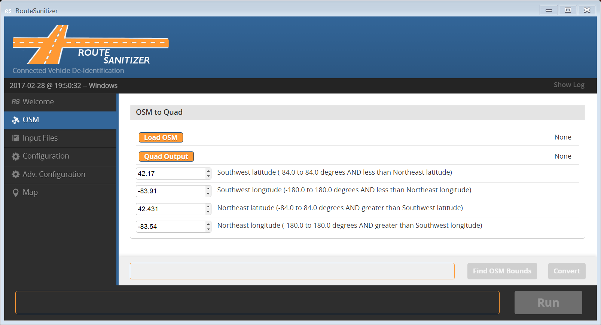

The following buttons in the OSM section will display the typical file
system explorer dialog box for file selection. (For additional folder
navigation options on a Mac, click the small down arrow at the end of
the **Save As** text box.)

- **Load OSM*:**  Specify the OSM file to be converted. The OSM
file must contain valid OSM data, but the file extension does not
matter.

- **Quad Output**: Specify a location and filename for the quad
file output from the OSM conversion. The filename extension specified
for the quad files does not matter, but for clarity we suggest using
“quad”.  

Since OSM files can be large (countries or continents), the user can
designate a smaller, more focused, area which encloses the geo-
coordinates of the trips in their database. The following parameters
control the bounding coordinates of the smaller area.

- **Southwest latitude (degrees)**: Latitude of the lower left
corner of the smaller bounding box. [-84.0 to 84.0 degrees, must be less
than Northeast latitude.]**

- **Southwest longitude (degrees)**: Longitude of the lower left
corner of the smaller bounding box. [-180.0 to 180.0 degrees, must be
less than Northeast longitude.]**

- **Northeast latitude (degrees)**: Latitude of the upper right
corner of the smaller bounding box. [-84.0 to 84.0 degrees, must be
greater than Southwest latitude.]**

- **Northeast longitude (degrees)**: Longitude of the upper
right corner of the smaller bounding box. [-180.0 to 180.0 degrees, must
be greater than Southwest longitude.]

The following buttons:

- **Find OSM Bounds**: Before specifying new latitude/longitude
bounds, it may be useful to know the bounds of the currently specified
OSM file. Click the **Find OSM Bounds** to obtain and display these
bounds (the above figure). Obtaining the minimum and maximum latitude and
longitude values in the OSM file requires reading the files, which may
take some time for a large OSM file. 

- **Convert**: Click this button to generate the quad file. A
progress bar indicates how far along the conversion process is. Any OSM
features needed by the sanitization algorithm (e.g., road segments) that
are partially within the bounds designated by the user will be included
in the resulting quad file.

Once a quad file is created using the *OSM* tab, it will be
automatically selected as the map information to be used for
sanitization and the quad file’s name will be pre-populated in the **Configuration** tab.


Input Files
-----------

The **Input Files** tab (the above figure) is an interface that allows the user
to specify one or more files that contain vehicle trajectories.
Currently, input files must be in comma-separated value (CSV) format
(additional formats may be integrated in the future). You need at least
one loaded input file to run the deidentification algorithm. The
**Run** button becomes active when at least one input file is
specified and an output directory has been selected on the Configuration
tab.

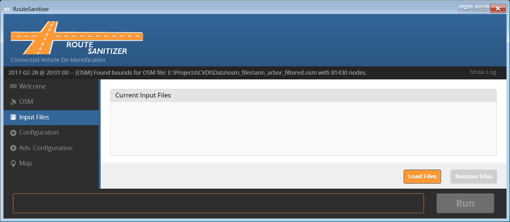

The following buttons in the Input Files section will display the
typical file system explorer dialog box for file selection:

- **Load Files**: Click this button to specify input files. In
the file browser pop-up, navigate to the directory where the input files
are located and select one or more files. After clicking the **Open**
button the selected files will be displayed in the **Current Input
Files** list on the Input Files tab. Additional input files can be
selected by clicking the Load Files button again.

- **Remove Files** : To remove files from the **Current Input
Files** list, click on each file that you want to remove and then click
the Remove Files button (the figure below). Multiple files can be removed from
the list at once.

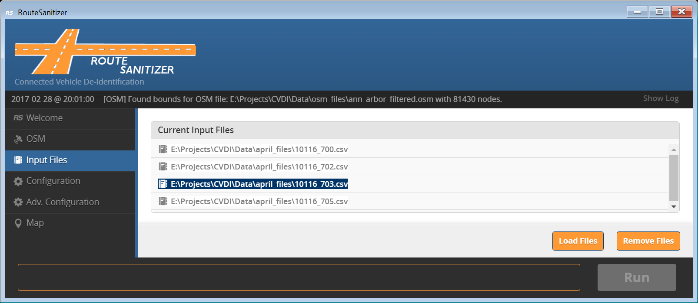

Configuration
-------------

The deidentification process is customizable. In other words, the user
can determine the sensitivity of critical interval detectors and how
privacy intervals are constructed. This translates roughly into
determining what is considered private and how those private locations
are protected against re-identification attacks.

Configuration is broken down into four sections: I/O (Input/Output), CSV
Field Names, KML Options, and Privacy Intervals. The configuration
parameters are described in the sections that follow.

### I/O

The I/O section of the Configuration tab (the figure below) allows the user to
specify input and output files required for the deidentification
process. Clicking on buttons in the I/O section results in the display
of an operating specific file/directory finder window in which the user
can navigate to the desired file name or folder.

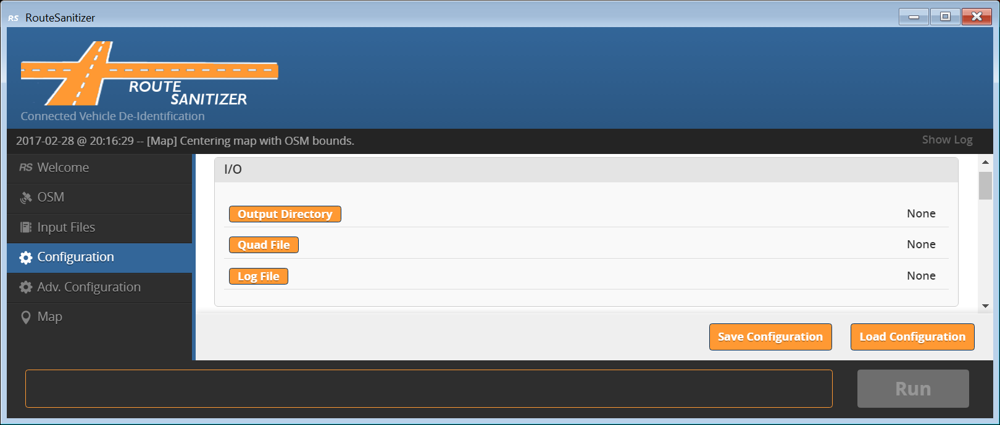

The following directory and files can be modified in the I/O section of
the Configuration tab:

- **Output Directory:** This button allows the user to specify
where the output of the sanitization process will be written. Results of
the deidentification process will be output to a subdirectory structure
under the specified output directory. Details for the output directory
structure are given in Appendix A.

- **Quad File**: The user must also designate a quad file that
contains the map information to be used during the deidentification
process. If a quad file was generated on the OSM tab during the current
execution of the Route Sanitizer application, the name of that file will
be automatically specified to the right of the Quad File button.
However, a different quad file can be specified using the Quad File
button. If a quad file is not specified, the algorithm can still be run
but map fitting will not be used to improve the deidentification
process.

- **Log File**: The user may designate a log file to which the
Route Sanitizer application will write information that might be useful
in the case of problems with the user interface or the deidentification
process.

### CSV Field Names

The input files specified in the Input Files tab contain comma separated
rows of data. The first line of each file contains a comma separated
list of field names that corresponds to the comma separated data values.
The field names may differ from one batch of CSV files to another, but
must be the same in all of the files processed in one run. The route
sanitizer needs to know the field names as specified in the CSV files. 
In the **CSV Field Names** section of the Configuration tab (the figure below),
the user must specify the field names used in the input CSV files for
each of the five key fields used to perform deidentification.

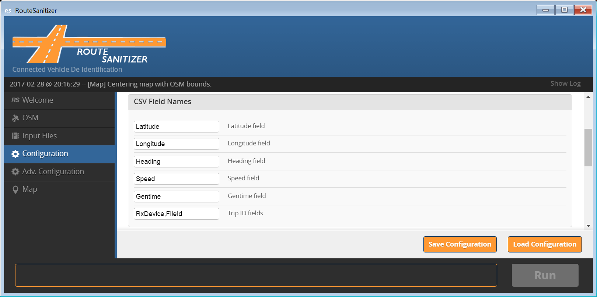

The following case-sensitive parameters can be modified in the CSV Field
Names section:

- **Latitude**: Field name of single column containing latitude
values. [Default: “Latitude”]

- **Longitude**: Field name of single column containing
longitude values. [Default: “Longitude”]  

- **Heading**: Field name of single column containing heading
values. [Default: “Heading”]

- **Speed:**: Field name of single column containing speed
values. [Default: “Speed”]

- **Gentime**: Name of single value generated time values.
[Default: “Gentime”]

- **Trip ID**: Comma separated list of field names corresponding
to multiple columns which together specifiy a unique identifier for each
row of data. [Default: “RxDevice,FileID”]

### KML Options

In the **KML Options** section of the Configuration tab (the figure below) the
user can specify whether or not KML map files will be output for each
input file processed. The files are written to a separate KML
subdirectory under the **Output Directory** specified in the **I/O**
section of the **Configuration** tab. When a large number of trips are
being processed, generating KML files may slow down the performance of
the algorithm significantly. If KML files are generated, the implicit
and explicit map fitting boxes can be included; this increases the size
of each KML file. The best approach to take when rendering
deidentification results is to sample a small subset of trajectories,
and then de-identify those with the parameter settings being
investigated.


The following parameters can be modified in the KML Options section:

- **Output KML Files**: If toggled on (circle to right, orange
background), an individual KML file will be generated for each
trajectory processed in the deidentification process.

### Privacy Intervals

In the **Privacy Intervals** section of the Configuration tab (Fig. 14)
the user can specify 6 of the 9 parameters controlling how privacy
intervals are determined in the deidentification process. As discussed
in Part 1, privacy intervals “protect” critical intervals by determining
how much of the trajectory surrounding the critical interval should be
removed. The amount removed depends on a criterion defined using several
metrics. In the Privacy Intervals section of the Configuration tab, each
of these metrics includes an input parameter for “Maximum” and “random
factor” value. The “Minimum” value for these metrics is rarely changed
and is included in the Adv. Configuration tab.

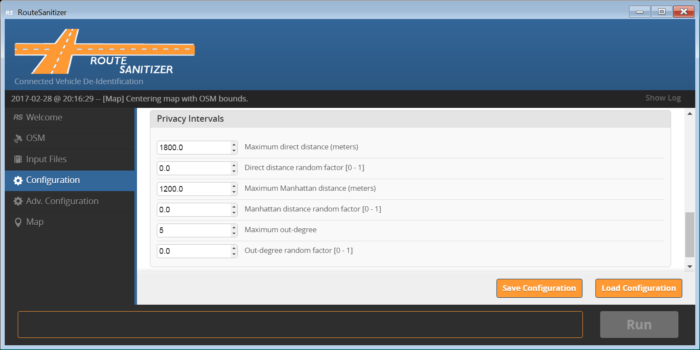

The following parameters can be modified in the Privacy Intervals
section:

- **Maximum direct distance (meters)**: Maximum direct distance
between the start of the privacy interval and the trip point currently
being evaluated during deidentification (i.e., the point-to-point
distance). This metric provides a radius of protection around each
critical interval. [Decimal value in meters, greater than Minimum direct
distance on Adv. Configuration tab.]

- **Direct distance random factor**: Randomness factor applied
to the minimum direct distance. [Decimal value between 0 and 1
inclusive.]

- **Maximum Manhattan distance (meters)**: Maximum actual
distance traveled over the road network; this is computed using the
explicit and implicit boxes generated during map fitting. [Decimal value
in meters, greater than Minimum Manhattan distance on Adv. Configuration
tab.]

- **Manhattan distance random factor**: Randomness factor
applied to the minimum Manhattan distance. [Decimal value between 0 and
1 inclusive.]

- **Maximum intersection out-degree count**: The maximum number
of possible directions a driver could choose at a particular
intersection. [Integer value, greater than intersection out-degree count
on Adv. Configuration tab.]

- **Out-degree random factor**: Randomness factor applied to the
minimum out-degree. [Decimal value between 0 and 1 inclusive.]

Advanced Configuration
------------------

Parameters on the Advanced Configuration tab should not need editing in
most circumstances. Only change the values for these parameters if you
understand how they affect the deidentification process.

### Map-Fit

Parameters in the Map-Fit section of the Adv. Configuration tab (Fig.
15) are used to improve the deidentification process by fitting the
vehicle GPS generated route data from the input files to road segments
in the OSM map file. As described in Part 2, explicit and implicit boxes
are constructed to aid in the map-fitting process.

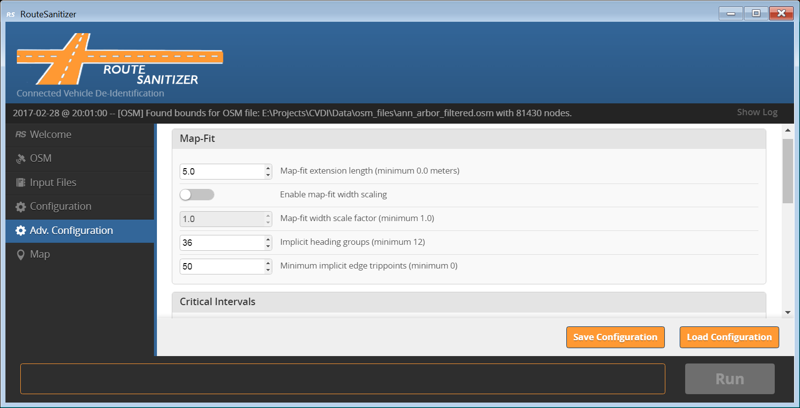

The following parameters can be modified in the Map-Fit section to
control the size of explicit and implicit boxes:

#### Explicit box parameters:

- **Map-fit extension length (meters)**: Extension length added
to both the left and right sides of an explicit map-fit box.  Values
greater than 0.0 may improve the accuracy of the map-fitting process.
[Decimal value greater than or equal to 0.0 meters.]

- **Enable map-fit width scaling**: If toggled on (circle to
right, orange background), the map-fit width scale factor parameter can
be modified and will be used in the map-fitting process.

- **Map-fit width scale factor**: Scale factor to be applied to
the width of an explicit map-fit boxes. A scaling factor of 1.0 leaves
the values unchanged; a scaling factor of 0.5 makes the boxes half as
wide as the pre-specified road width; a scaling factor of 2.0 makes the
boxes twice as wide. Width scaling is used to accommodate some drift in
GPS measurements without a significant drop in sanitization performance.
[Decimal value greater than or equal to 1.0.]

#### Implicit box parameters:

- **Implicit Heading Groups**: The number of equally sized
quadrants to divide the compass rose into. Each quadrant will have a
size of 360 degrees divided by the number of quadrants. While a
vehicle’s heading remains within a particular quadrant, the vehicle is
assumed to remain on an “implicit” road segment. [Integer value greater
than or equal to12.]

- **Minimum Implicit Edge Trippoints**: The minimum number of
trajectory points that must be contained in an implicit box before a new
one is created. [Integer value greater than or equal to 0.]

### Critical Intervals

Parameters in the Critical intervals section of the Adv. Configuration
tab (Fig. 16) are used to determine the critical intervals of trips that
should remain private as discussed in Part 1. Since we do not have any
additional information about the driver, the sanitization algorithm
finds critical intervals by analyzing the characteristics of trip
trajectories. Three detectors are used to locate critical intervals:

1. Trip beginning and endpoint detection.

1. Vehicle turnaround detection.

1. Vehicle stop detection.

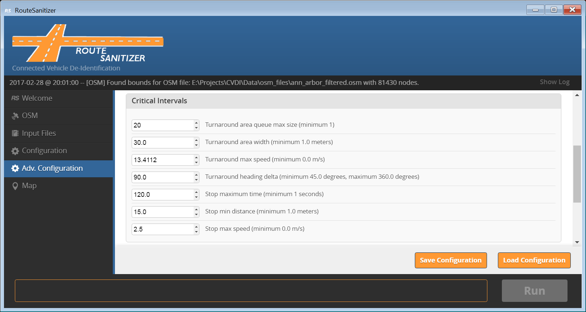

The sensitivity of these detectors is controlled by the following
modifiable parameters in the Critical Intervals section:

- **Turnaround area queue max size**: This parameter determines
the maximum number of implicit boxes that are maintained to detect a
turnaround. This parameter is related to the distance a vehicle can
travel before traveling the opposite direction on a previous traveled
implicit segment. [Integer value greater than or equal to 1.]

- **Turnaround area width (meters)**: This parameter determines
the width (size) of the implicit boxes generated when OSM information is
unavailable; these are the boxes that are stored in the list. Wider
boxes increase the likelihood of detecting a turnaround, but could also
lead to detecting behavior that should not be considered a turnaround
(i.e., a false positive). [Decimal value greater than or equal to 1.0.]

- **Turnaround max speed (m/s)**: The search for turnarounds
only occurs when a vehicle’s speed is below this threshold. [Decimal
value greater than or equal to 0.0.]

- **Turnaround heading delta (degrees)**: The second turnaround detection
strategy examines the difference in heading when a vehicle leaves an explicit
box and returns to an explicit box. The difference must exceed this
configuration parameter to be considered a turnaround.  [Decimal value greater
than or equal to 45.0 and less than or equal to 360.0.]

- **Stop maximum time (seconds)**: Consecutive trajectory points
over this time period (a subtrajectory) are examined for stop-like
behavior. [Decimal value greater than or equal to 11.0.]

- **Stop min distance (meters)**: A stop is only detected when
the distance traveled by a vehicle is less than this threshold over the
time period defined by maximum time. [Decimal value greater than or
equal to 1.0.]

- **Stop max speed (m/s)**: When a vehicle’s speed exceeds this
threshold no further analysis for stop-like behavior takes place. Lower
setting will improve the performance of the deidentification algorithm,
but it may cause certain types of stop-like behavior to be missed (e.g.,
a false negative). [Decimal value greater than or equal to 0.0.]

### Privacy Intervals (Advanced)

As discussed in Part 1, privacy intervals “protect” critical intervals
by determining how much of the trajectory surrounding the critical
interval should be removed. The amount removed depends on a criterion
defined using several metrics. In the Privacy Intervals section of the
Adv. Configuration tab, each of these metrics includes an input
parameter for “Minimum” value. The “Maximum” and “random factor” value
for these metrics is specified on the Configuration tab.

- **Minimum direct distance (meters)**: Minimum direct distance
between the start of the privacy interval and the trip point currently
being evaluated during deidentification (i.e., the point-to-point
distance). This metric provides a radius of protection around each
critical interval. [Decimal value in meters, greater than or equal to 0.0]

- **Minimum Manhattan distance (meters)**: Minimum actual
distance traveled over the road network; this is computed using the
explicit and implicit boxes generated during map fitting. [Decimal value
in meters, greater than or equal to 0.0]

- **Minimum intersection out-degree count**: The minimum number
of possible directions a driver could choose at a particular
intersection. [Integer value, greater than or equal to 0.]

Map
---

The *Map* tab allows a user to visually validate sanitized trips. The
trip is displayed and annotated using Google Maps within the tab’s main
window. There is performance overhead associated with rendering
annotated trip files. Although you can load multiple files, this is not
recommended.

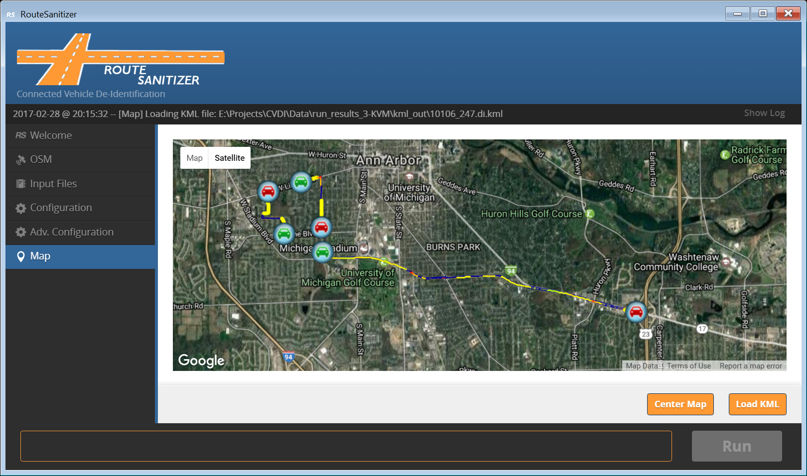

The following buttons in the Map tab control the map display:

**Load KML**: Click this button to load a KML file and render as a
Google map. The typical file system explorer dialog box will be
displayed for file selection.

**Center Map**: Click this button to center the map based on the
latitude and longitude bounds displayed in the OSM tab. If the loaded
KML map is smaller than the latitude and longitude bounds on the OSM
tab, the result will be to zoom out so that the user can see where the
trip segment is located within the larger map.

Google Maps functions the same way it does in any browser. Click and
drag the map to move to a new location; the upper right corner has two
buttons that allow you to switch between map and satellite view; the
mouse wheel zooms in and out on the map.

To unload or clear the map, simply click one of the other menu items and
then return to the map option. The map will be clear and a new file can
be loaded at this point.

Verifying Sanitized Trip Files
------------------------------

The Map tab is provided as a way for practitioners to verify whether the
parameters they are using are performing as intended. A random sample of
trajectories should be verified, and its size should be determined based
on the total number of trajectories in the dataset. The following
annotations are made on the de-identified trajectory:

- Vehicle Velocity: trajectory color corresponds to vehicle
velocity with red indicating zero velocity and green indicating 80 mph
or higher; the color is scaled from red to yellow to green across this
dynamic range.

- Critical Intervals: critical intervals are annotated as dark
pink lines. Critical intervals triggered by stop detection have an “S”
marker, and critical intervals triggered by turnaround detection have a
“T” marker.

- Privacy Intervals: privacy intervals are annotated as dark pink
lines.

These annotations are used for verification in several ways:

1. Determine whether the annotated critical intervals are at
locations that should be considered privacy sensitive.

1. Determine whether locations that should be considered privacy
sensitive has NOT been detected as critical intervals. Velocity and
Google Map imagery is valuable while inspecting the trip for missed
critical intervals.

1. Determine whether the annotated privacy intervals are providing
sufficient protection for their connected critical interval. The primary
way privacy protection is provided is through intersection out-degree
counts; intersections can be visually counted to ensure enough
uncertainty is being introduced through the privacy intervals.\

Logging
-------

Route Sanitizer includes two different logging capabilities. The first
logging function displays messages pertinent to the user interface and
the second logging function writes messages about the deidentification
run to a log file.

### User Interface Logging

As noted in the layout section, the component at the top of the user
interface is a single-line-width window that displays the latest
application feedback message. Fig. 6 shows the location of the logging
component. These messages indicate both normal and abnormal application
events. To show a scrollable list of events click *Show Log* on the
right side of the log area (see Fig. 6).

Logged events include loading or removal of files, changing the
configuration, and abnormal events. Log messages are formatted as
follows:

```
{Date} -- [{Severity}] [{Tab Name}] {Message}
```

{Severity} is optional and can be either [Warning] or [Error] with the
entire line displayed in yellow or red, respectively.

### Deidentification Run Logging

When the Run button is engaged to start the deidentification process, a
log file is created and information about the run is written to this
file. The name and location of the log file is specified in the I/O
section of the Configuration tab. The information written to the log
file includes the names of the quad file and the name of each input file
once it has been processed. The following is an example of the contents
of the log file:

```
[DI Log] Building quad from file: E:\\Projects\\CVDI\\Data\\osm\_files\\ann\_arbor.quad
[DI] De-identified trip: 10106\_251 from file: E:\\Projects\\CVDI\\Data\\april\_files\\10106\_251.csv
[DI] De-identified trip: 10106\_249 from file: E:\\Projects\\CVDI\\Data\\april\_files\\10106\_249.csv
[DI] De-identified trip: 10106\_252 from file: E:\\Projects\\CVDI\\Data\\april\_files\\10106\_252.csv
```

Multithreading
---------------

Route Sanitizer will attempt to use as many processor cores (execution
threads) as are available on the host machine when de-identifying
multiple trip files.  The amount of work that each core performs is
balanced based on trip file size. Since each trip can be processed
independently, this feature improves the overall performance of the
deidentification process for large trip databases.

Appendix A
==================================================

Example OSM File Format
-----------------------

An example OSM file is shown below: 

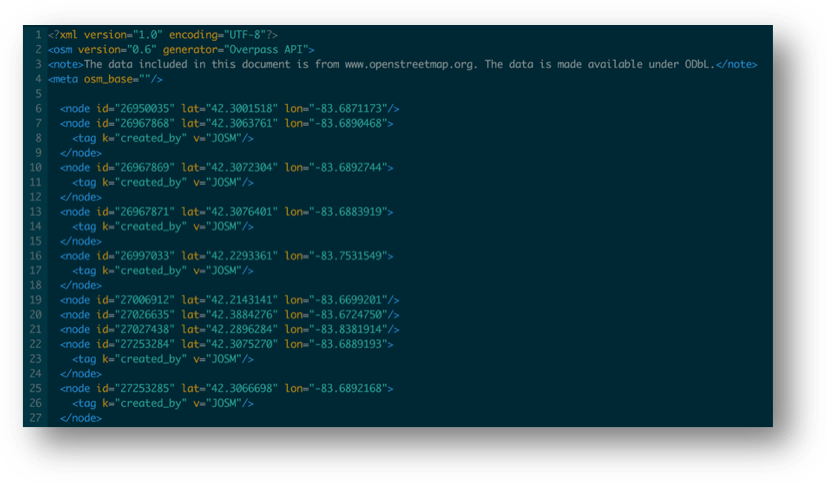

Example Quad File Format
------------------------

An example of a quad file is shown below. 

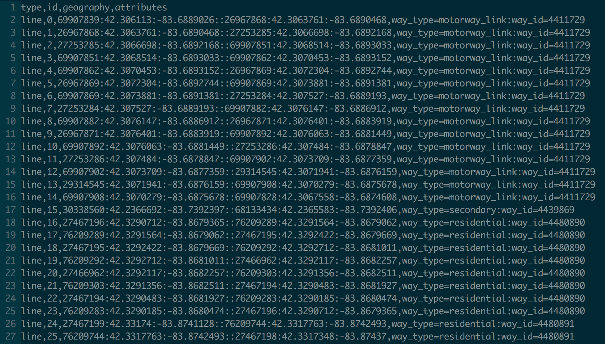

Example Input File Format
-------------------------

An example of a CSV input file is shown below.

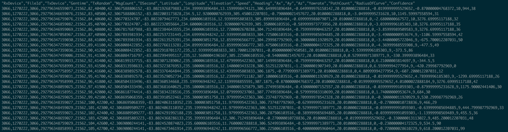

Output Directory and File Name Structure
----------------------------------------

The Output Directory button in the I/O section of the Configuration tab
(Fig. 11) allows the user to specify where the output of the
sanitization process will be written. A subdirectory will be created in
the output director called: **di\_out**. This will be the target
directory for de-identified files. If KML files are generated, a
subdirectory will be created in the output directory called:
**kml\_out**. This will be the target directory for the annotated KML
output files. The following is an example of the output directory
structure:

run\_results
di\_out
10106\_248.di.csv
10106\_249.di.csv
10106\_251.di.csv
kml\_out
10106\_248.di.kml
10106\_249.di.kml
10106\_251.di.kml

Output files are named using the same prefix as the input file.
Extensions are appended to differentiate the final output files from the
input files (even though they should be in separated directories). The
following naming rules are applied:

Input file name: **[prefix name].csv**
Output file name: **[prefix name].di.csv**
KML output file name: **[prefix name].di.csv.kml**
